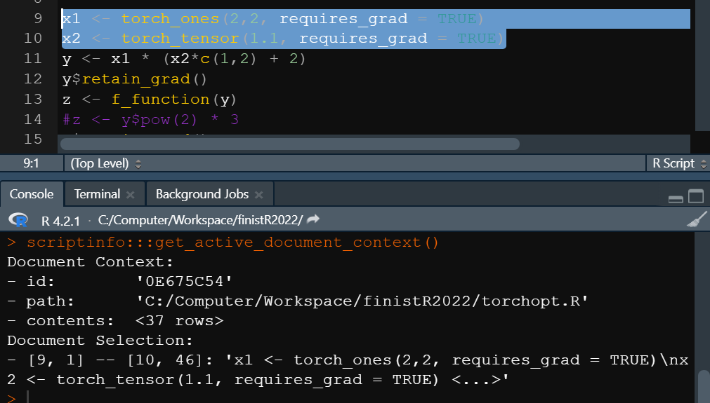
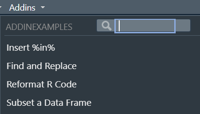
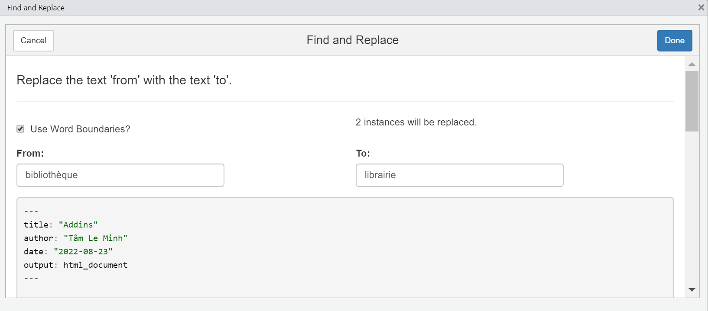
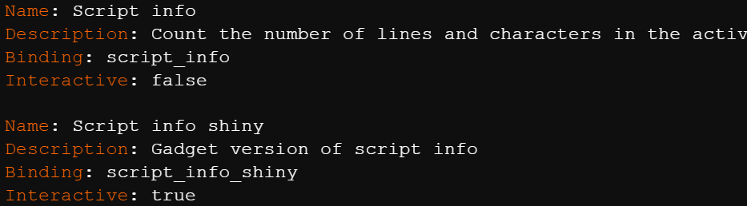

```{r setup, include=FALSE}
knitr::opts_chunk$set(echo = TRUE)
```

Les addins permettent d'appeler des fonctions R directement à partir de l'interface de RStudio. Ils visent principalement à améliorer l'expérience de l'utilisateur de RStudio. Les addins peuvent notamment communiquer avec l'IDE à travers la bibliothèque de fonctions rstudioapi. En effet, RStudio est capable de récupérer ces données grâce à la fonction getActiveDocumentContext(). Il est également possible de rajouter ou de remplacer du texte dans les fichiers ouverts.

{ width=50% }

Ils sont fournis par des packages. Une fois les packages installés, les addins sont automatiquement détectés par RStudio qui les ajoute à l'interface sans avoir besoin de charger les packages correspondant. Les addins installés apparaissent dans la barre d'outils.

{ width=50% }

Il est également possible de leur assigner un raccourci clavier (dans Tools -> Addins -> Browse addins).

{ width=50% }

## Les deux types d'addins

Il y a principalement deux types d'addins :

- les macros textuelles,

- les gadgets Shiny.

À travers des examples donnés dans le package addinexamples, on présente les possibilités offertes par les addins.

{ width=50% }

### Les macros textuelles

Ces addins modifient et tranforment du texte sur les fichiers de travail. Deux exemples de macros textuelles sont données : 'Insert %in%' et 'Reformat R code'. 

### Les gadgets Shiny

Ces addins ouvrent des applications Shiny dans RStudio, qui ont pour but de modifier ou de générer du code. Deux exemples sont fournis par addinexamples. 'Find and replace' recherche et remplace des chaînes de caractères par un autre dans tout le fichier. 'Subset a data frame' propose d'ouvrir une dataframe et de la visualiser en applicant des filtres, la commande permettant d'obtenir la dernière dataframe filtrée peut être exportée pour être incluse dans le code.

{ width=50% }

{ width=50% }

Autres exemples d'applications possibles : tracer des graphiques, modifier des objets, générer du code

## Faire ses propres addins : un exemple

On conçoit un addin scriptinfo qui compte les lignes et les charactères d'un document ouvert dans RStudio. On veut fournir un addin qui affiche les résultats dans la console et un addin qui les affiche sous la forme d'un Shiny gadget.

Pour créer et ajouter un addin à RStudio, il faut obligatoirement passer par un package.

Afin de signifier que le package contient des addins, il faut l'indiquer à RStudio avec un fichier inst/rstudio/addins.dcf dans le package. Ce fichier contient les informations des addins et les relie aux fonctions R qu'ils exécutent. À partir de cela, RStudio détecte automatiquement les addins si le package est installé.

{ width=50% }

{ width=50% }

Une fois le package compilé. Il peut être installé et les addins s'ajoutent automatiquement à RStudio.

{ width=50% }