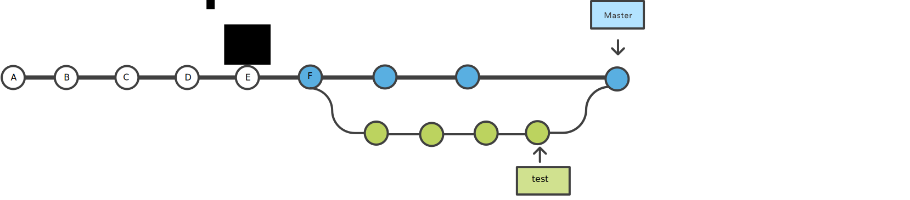
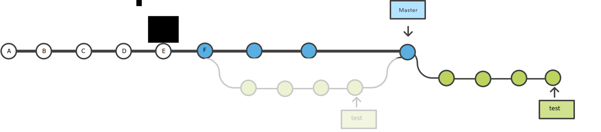
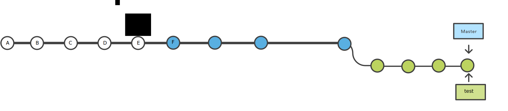

```{r setup, include=FALSE}
knitr::opts_chunk$set(echo = TRUE, cache = TRUE)
library(tidyverse)
```


# Rebase : réécrire l'histoire

La commande `git rebase` permet de réécrire l'histoire des commits, par exemple pour la rendre plus lisible. 

Pour éviter les soucis de compatibilité on évite de réécrire une histoire publique. On ne fait des rebase que sur des branches qui ne sont pas liées aux autres.

# Un exemple d'utilisation de rebase : le merge

Classiquement quand on merge une branche test dans master on a un historique de commit comme dans la figure suivante


</img>


Si cette situation se reproduit de nombreuses fois sur de nombreuses branches le graphe des commits devient vite illisible. Pour faciliter la vision de l'historique du projet on peut modifier cet arbre.


</img>


# En pratique 

Pour réussir facilement cette tâche, il suffit se positionner sur la branche test et on va faire comme si on avait commencé à développer test à partir de la dernière version de master

```{r rebase1, eval = FALSE}
git switch test
git rebase master
```

A l'issue de cette opération, test est une succession de changements initiés depuis la dernière version de master. En fussionnant master et test, on va juste faire avancer master de quelques commits on n'aura as de commit de merge.

```{r rebase2, eval = FALSE}
git switch master
git merge test
```


</img>


# Pour aller plus loin

Le rebase permet de réécrire toute l'histoire des commits. 
